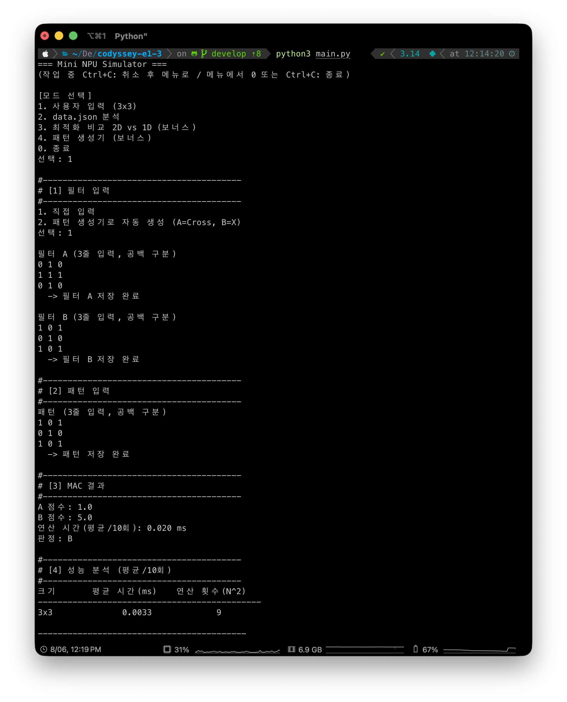
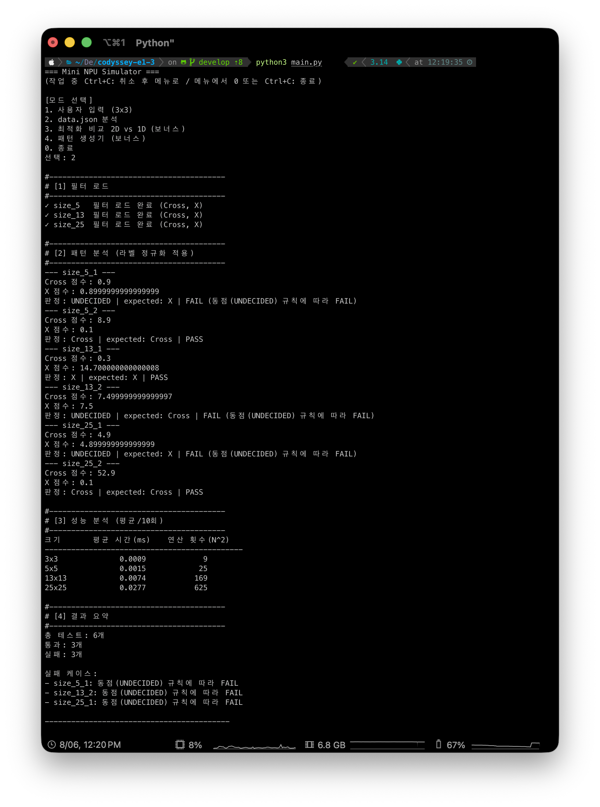
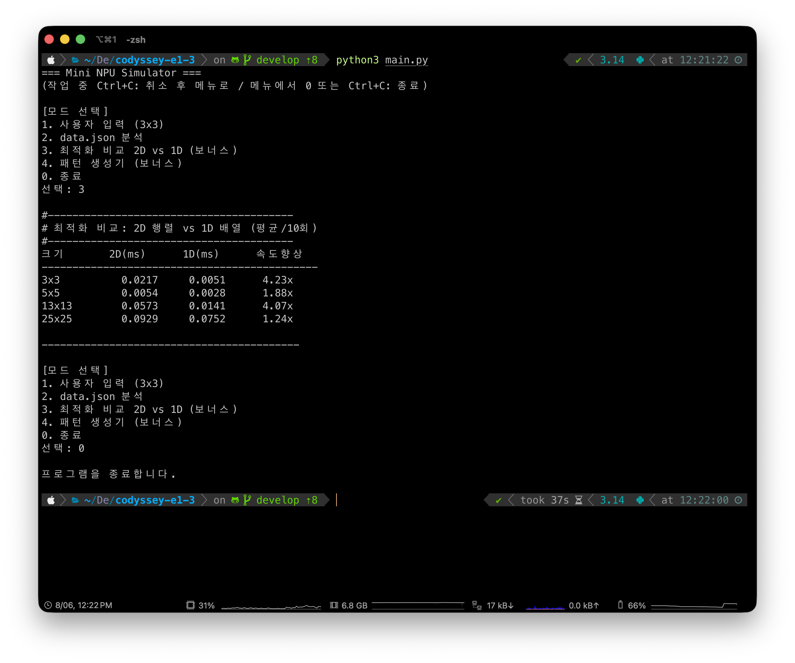

# Mini NPU Simulator

AI가 이미지를 인식하는 핵심 원리인 **MAC(Multiply-Accumulate) 연산**을 순수 파이썬
표준 라이브러리만으로 구현한 콘솔 애플리케이션입니다. 두 개의 필터(Cross, X) 중 입력
패턴과 더 유사한(점수가 높은) 쪽을 골라 "이 패턴은 십자가인가, X인가"를 판별합니다.

```
□ ■ □   ->  0 1 0     ■ □ ■   ->  1 0 1
■ ■ ■       1 1 1     □ ■ □       0 1 0
□ ■ □       0 1 0     ■ □ ■       1 0 1
 (Cross)                (X)
```

MAC은 두 배열을 겹쳐 같은 위치의 값끼리 곱하고(Multiply) 그 결과를 모두 더하는
(Accumulate) 연산입니다. 점수가 높을수록 패턴이 그 필터와 유사하다는 뜻입니다.

---

## 실행 방법

```bash
python main.py       # (또는 python3 main.py)
```

- 외부 라이브러리 없이 동작합니다. **Python 3.8 이상**만 있으면 됩니다.
- 실행하면 메뉴가 나타납니다.

```
[모드 선택]
1. 사용자 입력 (3x3)
2. data.json 분석
3. 최적화 비교 2D vs 1D (보너스)
4. 패턴 생성기 (보너스)
0. 종료
```

| 모드 | 설명 |
|------|------|
| **1** | 3×3 필터 A/B와 패턴을 콘솔로 직접 입력 → 점수·연산 시간·판정(A/B/판정 불가) |
| **2** | `data/data.json`을 로드해 일괄 판정 → 케이스별 PASS/FAIL·성능표·결과 요약 |
| **3** | (보너스) 2차원 배열 vs 1차원 배열 MAC의 연산 시간 비교 |
| **4** | (보너스) 크기 N을 입력하면 N×N Cross/X 패턴 자동 생성 + 검증 |

한 번 실행하면 메뉴가 반복 출력되므로 여러 모드를 연속으로 사용할 수 있습니다.
모드 1의 필터는 직접 입력하는 대신 **패턴 생성기가 만든 3×3 Cross/X를 재사용**할 수도
있습니다.

### 종료 및 중단 규칙

| 상황 | 동작 |
|------|------|
| 메뉴에서 `0` / `q` / `quit` / `exit` / `종료` 입력 | 프로그램 종료 (exit code 0) |
| 메뉴에서 `Ctrl+C` | 프로그램 종료 (exit code 0, traceback 없음) |
| 작업 중 `Ctrl+C` | **해당 작업만 취소**하고 메뉴로 복귀 |
| `Ctrl+D` 또는 파이프 입력 종료(EOF) | 안내 문구 출력 후 정상 종료 |
| 잘못된 메뉴 번호 입력 | 안내 문구 출력 후 메뉴 유지 |
| 모드 실행 중 예기치 못한 오류 | 오류 메시지 출력 후 메뉴 유지 (프로그램 유지) |

- **데이터 파일 위치:** `data/data.json`을 먼저 찾고, 없으면 프로젝트 루트와 현재 작업
  디렉토리의 `data.json`을 차례로 탐색합니다. 실행 위치와 무관하게 동작합니다.

### 모드 1 입력 예시

```
필터 A (3줄 입력, 공백 구분)
0 1 0
1 1 1
0 1 0
필터 B (3줄 입력, 공백 구분)
1 0 1
0 1 0
1 0 1
패턴 (3줄 입력, 공백 구분)
1 0 1
0 1 0
1 0 1
=> A 점수: 1.0 / B 점수: 5.0 / 판정: B
```

행/열 개수가 맞지 않거나 숫자가 아닌 값을 입력하면 안내 문구를 출력하고 해당 줄을
다시 입력받습니다.

---

## 실행 화면

각 모드의 실행 화면 캡처는 `docs/screenshots/`에 있습니다.

| 모드 | 스크린샷 |
|------|----------|
| 1. 사용자 입력 (3x3) | `docs/screenshots/mode1.png` |
| 2. data.json 분석 | `docs/screenshots/mode2.png` |
| 3. 최적화 비교 2D vs 1D | `docs/screenshots/mode3.png` |
| 4. 패턴 생성기 | `docs/screenshots/mode4.png` |






아래는 각 모드의 실제 출력 로그입니다(성능 표의 시간 값은 실행 환경에 따라 달라집니다).

### 모드 1 — 사용자 입력 (3×3)

```
[모드 선택]
1. 사용자 입력 (3x3)
2. data.json 분석
3. 최적화 비교 2D vs 1D (보너스)
4. 패턴 생성기 (보너스)
0. 종료
선택: 1

#----------------------------------------
# [1] 필터 입력
#----------------------------------------
1. 직접 입력
2. 패턴 생성기로 자동 생성 (A=Cross, B=X)
선택: 1

필터 A (3줄 입력, 공백 구분)
0 1 0
1 1 1
0 1 0
  -> 필터 A 저장 완료

필터 B (3줄 입력, 공백 구분)
1 0 1
0 1 0
1 0 1
  -> 필터 B 저장 완료

#----------------------------------------
# [2] 패턴 입력
#----------------------------------------
패턴 (3줄 입력, 공백 구분)
1 0 1
0 1 0
1 0 1
  -> 패턴 저장 완료

#----------------------------------------
# [3] MAC 결과
#----------------------------------------
A 점수: 1.0
B 점수: 5.0
연산 시간(평균/10회): 0.002 ms
판정: B

#----------------------------------------
# [4] 성능 분석 (평균/10회)
#----------------------------------------
크기       평균 시간(ms)    연산 횟수(N^2)
---------------------------------------------
3x3              0.0013             9
```

필터 입력 단계에서 `2`를 고르면 패턴 생성기가 만든 3×3 Cross/X가 그대로 필터 A/B로
쓰입니다(보너스 재활용).

```
#----------------------------------------
# [1] 필터 입력
#----------------------------------------
1. 직접 입력
2. 패턴 생성기로 자동 생성 (A=Cross, B=X)
선택: 2

필터 A (Cross) 자동 생성
0 1 0
1 1 1
0 1 0

필터 B (X) 자동 생성
1 0 1
0 1 0
1 0 1
```

### 모드 2 — data.json 분석

```
선택: 2

#----------------------------------------
# [1] 필터 로드
#----------------------------------------
✓ size_5   필터 로드 완료 (Cross, X)
✓ size_13  필터 로드 완료 (Cross, X)
✓ size_25  필터 로드 완료 (Cross, X)

#----------------------------------------
# [2] 패턴 분석 (라벨 정규화 적용)
#----------------------------------------
--- size_5_1 ---
Cross 점수: 0.9
X 점수: 0.8999999999999999
판정: UNDECIDED | expected: X | FAIL (동점(UNDECIDED) 규칙에 따라 FAIL)
--- size_5_2 ---
Cross 점수: 8.9
X 점수: 0.1
판정: Cross | expected: Cross | PASS
--- size_13_1 ---
Cross 점수: 0.3
X 점수: 14.700000000000008
판정: X | expected: X | PASS
--- size_13_2 ---
Cross 점수: 7.499999999999997
X 점수: 7.5
판정: UNDECIDED | expected: Cross | FAIL (동점(UNDECIDED) 규칙에 따라 FAIL)
--- size_25_1 ---
Cross 점수: 4.9
X 점수: 4.899999999999999
판정: UNDECIDED | expected: X | FAIL (동점(UNDECIDED) 규칙에 따라 FAIL)
--- size_25_2 ---
Cross 점수: 52.9
X 점수: 0.1
판정: Cross | expected: Cross | PASS

#----------------------------------------
# [3] 성능 분석 (평균/10회)
#----------------------------------------
크기       평균 시간(ms)    연산 횟수(N^2)
---------------------------------------------
3x3              0.0019             9
5x5              0.0036            25
13x13            0.0170           169
25x25            0.0576           625

#----------------------------------------
# [4] 결과 요약
#----------------------------------------
총 테스트: 6개
통과: 3개
실패: 3개

실패 케이스:
- size_5_1: 동점(UNDECIDED) 규칙에 따라 FAIL
- size_13_2: 동점(UNDECIDED) 규칙에 따라 FAIL
- size_25_1: 동점(UNDECIDED) 규칙에 따라 FAIL
```

### 모드 3 — 최적화 비교 2D vs 1D (보너스)

```
선택: 3

#----------------------------------------
# 최적화 비교: 2D 행렬 vs 1D 배열 (평균/10회)
#----------------------------------------
크기       2D(ms)      1D(ms)      속도향상
---------------------------------------------
3x3          0.0019     0.0009      2.17x
5x5          0.0024     0.0013      1.84x
13x13        0.0115     0.0076      1.51x
25x25        0.0378     0.0310      1.22x
```

### 모드 4 — 패턴 생성기 (보너스)

```
선택: 4

생성할 패턴 크기 N 입력(예: 5): 5

[생성된 Cross 패턴]
0 0 1 0 0
0 0 1 0 0
1 1 1 1 1
0 0 1 0 0
0 0 1 0 0

[생성된 X 패턴]
1 0 0 0 1
0 1 0 1 0
0 0 1 0 0
0 1 0 1 0
1 0 0 0 1

[검증] 입력=Cross 패턴 -> Cross 점수: 9.0, X 점수: 1.0, 판정: Cross

[생성 패턴 성능 분석]
크기       평균 시간(ms)    연산 횟수(N^2)
---------------------------------------------
5x5              0.0016            25
```

### 중단 동작

작업 중 `Ctrl+C`를 누르면 해당 작업만 취소하고 메뉴로 돌아옵니다.

```
생성할 패턴 크기 N 입력(예: 5): ^C
작업을 취소했습니다. 메뉴로 돌아갑니다.

[모드 선택]
1. 사용자 입력 (3x3)
...
0. 종료
선택: 0

프로그램을 종료합니다.
```

---

## 프로젝트 구조

책임(계층)별로 `npu` 패키지에 분리했습니다. 하위 계층일수록 의존성이 적고, 상위
계층(`cli`)이 이들을 조립합니다. 의존 방향은 `core ← bench/dataset ← cli ← main`
단방향(순환 없음)입니다.

```
main.py              # 진입점: 메뉴 출력 + 모드 디스패치만
npu/
├── core.py          # 상수/정책, 라벨 정규화, 행렬 자료구조, MAC 연산·판정 (최하위)
├── dataset.py       # data.json 로드, 스키마/크기 검증, 케이스 판정
├── bench.py         # 성능 측정(2D·1D) 및 패턴 생성기
└── cli.py           # 콘솔 입력 헬퍼 + 실행 흐름(run_mode1/2, 보너스)
tests/
├── test_core.py     # 라벨·행렬·MAC·판정 단위 테스트
└── test_dataset.py  # 키 파싱·필터 정규화·케이스 판정·실제 data.json 검증
data/
└── data.json        # 필터(5/13/25)와 패턴(input/expected)
```

### 테스트 실행

```bash
python -m unittest discover -s tests    # (또는 python3)
```

표준 라이브러리 `unittest`만 사용하며, 모듈 분리 덕분에 UI(입력/출력) 없이 핵심
로직(`core`, `dataset`)만 독립적으로 검증할 수 있습니다.

---

## 구현 요약

- **데이터 구조:** N×N 행렬을 2차원 리스트로 표현하고, `create_matrix` / `get_cell` /
  `set_cell` 접근 함수로 특정 위치 값을 저장·조회합니다. 3×3, 5×5, 13×13, 25×25를
  모두 처리합니다.
- **MAC 연산:** `mac_2d(pattern, filter)`가 이중 반복문으로 위치별 곱셈을 누적합니다.
  NumPy 등 벡터화 라이브러리는 사용하지 않습니다.
- **라벨 정규화:** 내부 표준 라벨은 `Cross`, `X` 두 가지입니다. `normalize_label()`이
  expected 값 `'+' → Cross`, `'x' → X`, 필터 키 `'cross' → Cross`, `'x' → X`로
  통일합니다. 이후의 모든 비교·출력은 표준 라벨을 기준으로 수행합니다.
- **동점 처리(epsilon):** 점수 비교는 허용오차 기반입니다. `abs(Cross - X) < 1e-9`
  이면 부동소수점 오차 수준의 미세한 차이로 보고 **동점(UNDECIDED)**으로 판정합니다.
- **스키마/크기 검증:** 모드 2는 패턴 키 `size_{N}_{idx}`에서 N을 뽑아 해당 `size_N`
  필터를 선택하고, 패턴과 필터의 크기가 일치하는지 검사합니다. 키 형식 오류·필터 누락·
  크기 불일치·라벨 오류가 있어도 **프로그램을 중단하지 않고 해당 케이스만 FAIL**로
  처리합니다.
- **성능 측정:** 각 크기별로 MAC 연산을 10회 반복 측정한 평균 시간(ms)을 표로
  출력합니다. 파일 읽기/출력 등 I/O를 제외하고 연산 함수 호출 구간만 측정합니다.

---

## 결과 리포트

### data.json 분석 결과 요약

```
총 테스트: 6개
통과: 3개 (size_5_2, size_13_1, size_25_2)
실패: 3개 (size_5_1, size_13_2, size_25_1)
```

### FAIL 케이스 원인 분석

실패 원인은 진단 관점에서 **① 데이터/스키마 문제, ② 로직 문제, ③ 수치 비교 문제**
세 가지로 나눌 수 있습니다. 이번 데이터셋의 FAIL 3건은 모두 **③ 수치 비교 문제
(동점)**에 해당합니다.

- **라벨/스키마는 원인이 아닙니다.** 6개 케이스의 필터 키(`cross`/`x`)와 expected
  값(`+`/`x`)은 모두 정상적으로 `Cross`/`X`로 정규화되었고, 필터-패턴 크기도 전부
  일치했습니다. 즉 정규화가 없었다면 `'+'`와 `'Cross'`를 다른 라벨로 취급해 정상
  케이스까지 FAIL이 났을 텐데, 정규화 덕분에 그런 오탐이 0건입니다.
- **실제 FAIL 3건(size_5_1, size_13_2, size_25_1)은 Cross 점수와 X 점수가 사실상
  같은 "동점" 케이스**입니다. 예를 들어 size_5_1은 Cross=0.9, X=0.8999999999999999로
  두 값의 차이가 약 `1.1e-16`에 불과합니다. 이는 실수를 더하는 순서에서 생기는
  부동소수점 오차 수준이며, 수학적으로는 같은 값으로 보아야 합니다.
- 만약 epsilon 없이 `Cross > X`를 그대로 비교했다면 이 미세한 오차 때문에 매번
  들쭉날쭉한(그리고 신뢰할 수 없는) 판정이 나왔을 것입니다. 그래서 `abs(A-B) < 1e-9`
  정책으로 이들을 **UNDECIDED**로 판정했고, expected(X 또는 Cross)와 다르므로 규칙에
  따라 FAIL로 집계됩니다.
- 정리하면, 이 FAIL은 "버그"가 아니라 **동점을 안전하게 UNDECIDED로 처리하는 정책이
  의도대로 작동한 결과**입니다. 데이터가 애초에 판별 불가능한(두 필터에 똑같이
  반응하는) 패턴을 담고 있어, 성실한 시뮬레이터라면 오히려 UNDECIDED를 내야 합니다.

### 성능 표 해석과 시간 복잡도 (O(N²))

측정 환경에 따라 절대값은 달라지지만, 대표적인 측정 결과는 다음과 같습니다.

| 크기 (N×N) | 평균 시간(ms) | 연산 횟수 (N²) |
|-----------|--------------|----------------|
| 3×3       | 0.0009       | 9              |
| 5×5       | 0.0016       | 25             |
| 13×13     | 0.0088       | 169            |
| 25×25     | 0.0483       | 625            |

- MAC은 N×N 행렬의 **모든 칸을 정확히 한 번씩** 곱하고 더합니다. 따라서 곱셈·덧셈
  횟수는 항상 N²이고, 시간 복잡도는 **O(N²)**입니다.
- 연산 횟수를 보면 3×3(9)에서 25×25(625)로 약 **69배** 늘어납니다. 위 측정에서도
  시간이 0.0009ms → 0.0483ms로 약 50배 이상 증가해, 연산 횟수 증가 추세와 같은
  방향으로 맞아떨어집니다(작은 크기는 반복 호출·측정 오버헤드가 상대적으로 커서
  완전한 비례에서 약간 벗어납니다).
- **한 변(N)을 2배로 늘리면 시간은 약 4배**가 됩니다. 필터 크기가 수백×수백으로
  커지고 그런 필터가 수천 개가 되면 총 연산량이 폭발적으로 늘어나며, 이것이 병렬
  처리에 특화된 AI 전용 칩(NPU)이 필요한 이유입니다.

### 보너스 — 1차원 배열 최적화 (2D vs 1D)

2차원 리스트는 값을 읽을 때 바깥 리스트 → 안쪽 리스트로 두 번 인덱싱합니다. 이를 길이
N²의 1차원 배열로 펼치면 인덱싱이 한 번으로 단순해집니다. 동일 입력·동일 반복 조건에서
1D 방식이 일관되게 더 빠릅니다(측정 예: 5×5에서 약 1.8배). 다만 두 방식 모두 연산
횟수 자체는 N²로 동일하므로 **시간 복잡도는 그대로 O(N²)**이며, 개선되는 것은 상수
계수(칸당 접근 비용)입니다.

### 재현성 메모

- 모드 1: 3×3 Cross 필터·X 필터·패턴을 예시대로 입력하면 점수/판정/시간이 정상
  출력됩니다.
- 모드 2: `data/data.json` 분석 시 위 6건의 PASS/FAIL과 총계(총 6 / 통과 3 / 실패 3)가
  항상 일치합니다.
- 의도적 오류(행/열 개수 불일치, 크기 불일치 등)에 대해 모드 1은 재입력을 유도하고,
  모드 2는 케이스 단위 FAIL로 처리하며 프로그램이 중단되지 않습니다.
